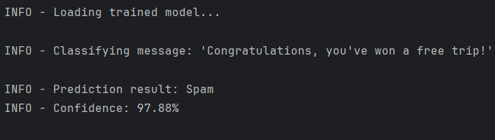

<!-- PROJECT LOGO -->
 

    

<h3 align="center">SMS Spam Classifier</h3>

<!-- TABLE OF CONTENTS -->

  
Table of Contents

  <ol>
    <li><a href="#about-the-project">About The Project</a></li>
    <li><a href="#main-features">Main Features</a></li>
    <li><a href="#installation-steps">Installation Steps</a></li>
    <li><a href="#built-with">Built With</a></li>
    <li><a href="#screenshots">Screenshots</a></li>
    <!--<li><a href="#udacity-certificate">Udacity Certificate</a></li>-->
    <li><a href="#contact">Contact</a></li>
  </ol> 

<!-- ABOUT THE PROJECT -->

## About The Project

- **Project Name:** SMS Spam Classifier
- **Version:** v1.0.0
- **Purpose:** To classify SMS messages as spam or not spam using the Naive Bayes algorithm.
- **HTML Notebook Preview:** The project contains an HTML version of the notebook for quick access, available at `docs` inside the repository.

### Description

SMS Spam Classifier is a machine learning project designed to identify and classify SMS messages as spam or ham. The project was initially developed in a Jupyter Notebook for analysis and experimentation and later modularized into a command-line application for real-world usability. Users can train a spam detection model using labeled SMS datasets, validate the model's performance, and make predictions directly from the command line.

The application is configurable via a `config.yaml` file, allowing seamless management of hyperparameters, file paths, and logging options.

(<a href="#readme-top">back to top</a>)

## Main Features

- **Notebook to CLI Transformation:** Initially a Jupyter Notebook, now a fully modular command-line application.
- **Training Module:** Train the classifier on labeled SMS datasets and save the trained model.
- **Prediction Module:** Predict whether a given SMS message is spam or ham using the trained model.
- **Logging:** Logs all operations and results to both the console and a timestamped log file in the `logs/` directory.
- **Config-Driven Architecture:** Manage file paths, hyperparameters, and logging levels via `config.yaml`.
- **Modular Design:** Structured into reusable modules for training, prediction, and utilities.

(<a href="#readme-top">back to top</a>)

## Installation Steps

To set up the environment and run the project, follow these steps:

1. **Clone the Repository:**
   - Download the repository to your local machine.

2. **Set Up the Conda Environment:**
   - Use the provided `environment.yml` file to create a conda environment:
     - **Environment Name:** `sms-spam-classifier`
     - **Python Version:** `3.10.15`
     - **Dependencies:** Includes `pandas`, `scikit-learn`, `numpy`, and logging utilities.

3. **Activate the Environment:**
   - Activate the environment after installation.

4. **Prepare the Dataset:**
   - Ensure the dataset file `SMSSpamCollection` is located in `data/input/`.

(<a href="#readme-top">back to top</a>)

## Built With

- **Python 3.10.15**: Core programming language for the project.
- **scikit-learn**: For training and evaluating the Naive Bayes classifier.
- **pandas**: For dataset manipulation and preprocessing.
- **logging**: For capturing application logs.
- **conda**: For environment management.

(<a href="#readme-top">back to top</a>)

## Screenshots

### Training

### Prediction

### Data Preview

### Data Preprocessing

(<a href="#readme-top">back to top</a>)

<!--
## Udacity Certificate

This project is part of the NLP Nanodegree by Udacity.

(<a href="#readme-top">back to top</a>)

-->

## Contact

Mohamed AbdelGawad Ibrahim - [LinkedIn](https://www.linkedin.com/in/m-abdelgawad/) - <a href="mailto:muhammadabdelgawwad@gmail.com">muhammadabdelgawwad@gmail.com</a>

(<a href="#readme-top">back to top</a>)

